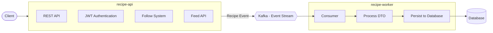

## 🍽️ Share My Recipe                            
A distributed, event-driven backend system for a recipe platform with asynchronous processing using Kafka. 

I built this to move beyond basic CRUD operations. The architecture handles recipe processing asynchronously, ensuring the API stays snappy even under heavy database load or high traffic spikes.

🏗️ Architecture
The system is decoupled into two specialized services to separate concerns and allow for independent scaling.

API Service: Manages JWT Auth, Follows, and Feed generation. When a Chef posts a recipe, the API validates the request, publishes a RecipeDTO to Kafka, and immediately returns 202 Accepted.

Worker Service: Acts as a background consumer. It listens to the recipe-topic, processes the DTO, and handles the actual DB persistence.

## Features                                                                                                                         
JWT Auth: Full RBAC (Role-Based Access Control) implementation with ROLE_USER, ROLE_CHEF, and ROLE_ADMIN.

Async Lifecycle: Recipe creation is decoupled from the DB; state transitions (DRAFT to PUBLISHED) are handled via event streams.

Personalized Feed: High-efficiency retrieval of recipes only from creators a user follows.

Dynamic Filtering: Implemented Spring Data Specifications for complex searching (keyword search across multiple fields, date range filtering, etc.).

Dockerized: Full multi-container setup including Kafka and MySQL.

Error Handling: Centralized exception handling using a global exception handler for consistent API responses.                       

## 🛠️ Tech Stack                                                             

- Java 17 / Spring Boot 3                                              
- Apache Kafka (KRaft mode, no Zookeeper)                                               
- MySQL (Persistence Layer)                               
- Spring Security & JWT                      
- Docker & Docker Compose                                                                                                

## ⚙️ How to Run                                                                                       
Make sure you have Docker installed and running.

Bash
docker-compose up --build                                                                      
## 🔗 Key Endpoints                                                                      
POST /register | POST /signin — Authentication & account setup.

POST /recipes — Recipe creation (Restricted to Chef role).

PUT /recipes/{id}/publish — Transition recipe to live status.

POST /follow/{chefId} — Follow system for feed generation.

GET /feed — Paginated personalized timeline.

## 🧠 Design Decisions                                                                              
Why Kafka? By decoupling the write-path, the system is resilient. If the Database or Worker service goes down, the API can still accept recipes, and Kafka will buffer them until the downstream services recover.

Pagination: Handled at the database level using Pageable to ensure the app doesn't fetch unnecessary records into memory.

Scalability: Since the Worker is a separate service, we can spin up multiple instances of the worker to handle high volumes of Kafka messages without touching the API code.

## ⚠️ Future Work                                                                                                     
Image Service: S3 integration for recipe image uploads and resizing.

Redis: Implementing a caching layer for the Feed API to reduce SQL join overhead.

Search: Migrating keyword search to Elasticsearch for better performance on large datasets.                                

## 💡 Key Takeaway                                                   

This project demonstrates how to evolve a traditional synchronous CRUD system into an event-driven architecture using Kafka to improve scalability, resilience, and system responsiveness.
