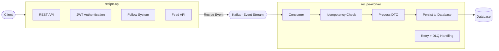

## 🍽️ Share My Recipe

A distributed, event-driven backend system for a recipe platform using Kafka for asynchronous processing.

This project goes beyond traditional CRUD by decoupling request handling from database persistence. The API remains responsive under load while background workers handle processing reliably.

---

## 🏗️ Architecture

The system is split into two independent services for scalability and fault isolation:



### 🔹 API Service (recipe-api)

* Handles authentication, follow system, and feed generation
* Publishes `RecipeDTO` events to Kafka
* Returns **202 Accepted** immediately (non-blocking)

### 🔹 Worker Service (recipe-worker)

* Consumes events from Kafka
* Performs idempotency checks to avoid duplicate processing
* Persists recipes to the database
* Handles retries and routes failed messages to DLQ

---

## 🚀 Key Kafka Enhancements (NEW)

* **Retry Mechanism**: Implemented using `DefaultErrorHandler` with configurable backoff (3 retries)
* **Dead Letter Queue (DLQ)**: Failed messages are routed to `recipe-topic.DLT` after retries
* **DLQ Consumer**: Dedicated listener to capture and log failed events for manual intervention
* **Idempotent Consumer**: Ensures duplicate Kafka messages are ignored using `ProcessedEvent` table
* **Event Keying**: Kafka message key (`eventId`) used for tracking and deduplication

---

## Features

* **JWT Auth**: Full RBAC implementation with ROLE_USER, ROLE_CHEF, ROLE_ADMIN
* **Async Lifecycle**: Recipe creation decoupled from DB using Kafka events
* **Personalized Feed**: Efficient feed generation based on followed chefs
* **Dynamic Filtering**: Spring Data Specifications for flexible querying
* **Dockerized Setup**: Kafka, MySQL, and services via Docker Compose
* **Centralized Error Handling**: Consistent API error responses

---

## 🛠️ Tech Stack

* Java 17 / Spring Boot 3
* Apache Kafka (KRaft mode, no Zookeeper)
* MySQL
* Spring Security & JWT
* Docker & Docker Compose

---

## ⚙️ How to Run

Make sure Docker is running:

```bash
docker-compose up --build
```

---

## 🔗 Key Endpoints

* `POST /register` | `POST /signin` — Authentication
* `POST /recipes` — Create recipe (async via Kafka)
* `PUT /recipes/{id}/publish` — Publish recipe
* `POST /follow/{chefId}` — Follow chefs
* `GET /feed` — Personalized feed

---

## 🧠 Design Decisions

* **Why Kafka?**
  Decouples API from DB writes → improves resilience and responsiveness

* **Idempotency**
  Ensures safe reprocessing under at-least-once delivery semantics

* **Retry + DLQ Strategy**
  Prevents message loss and isolates failed events for debugging

* **Scalability**
  Worker service can be scaled independently to handle load

* **Pagination**
  Database-level pagination avoids memory overhead

---

## ⚠️ Future Work

* S3 integration for image uploads
* Redis caching for feed optimization
* Elasticsearch for advanced search
* DLQ reprocessing dashboard / API

---

## 💡 Key Takeaway

This project demonstrates how to evolve a synchronous CRUD system into a resilient, scalable event-driven architecture using Kafka with production-grade patterns like retry, DLQ, and idempotent consumers.
